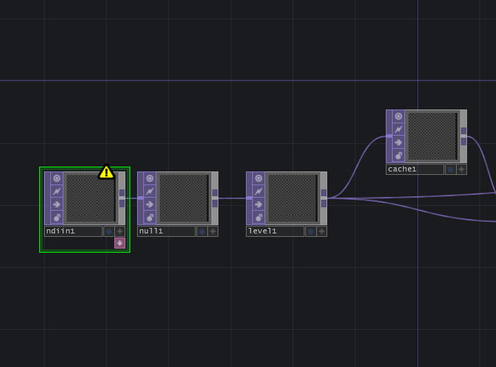
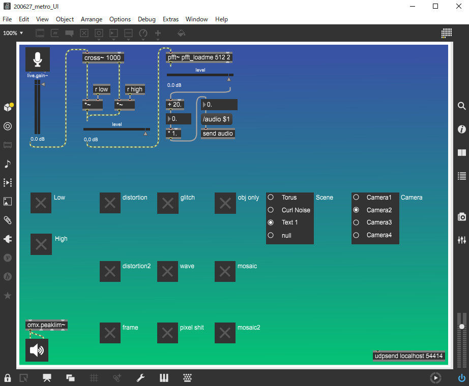

# 200627-Metro

This is VJ system for Save The Metro Compilations -DAY2-.

## Usage
### TouchDesigner

Change NDI In TOP in NDI COMP to Video Device In Top or Movie File In Top.

### Max8

Max8 is used for VJ UI. OSC port is "54414".

## Example

## Author
### Santa
- [Portfolio](https://santa-sukitoku.netlify.app/)
- [Twitter](https://twitter.com/santa_sukitoku)